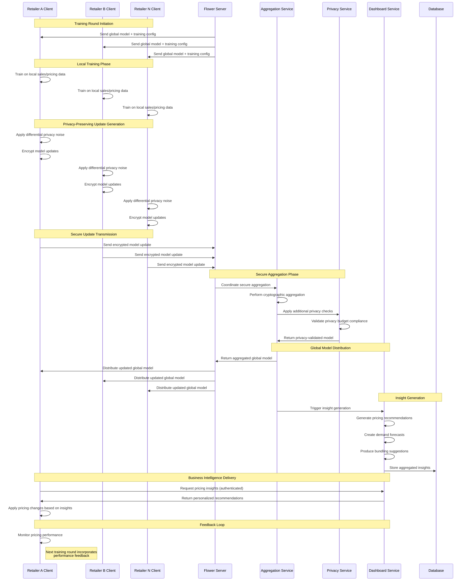
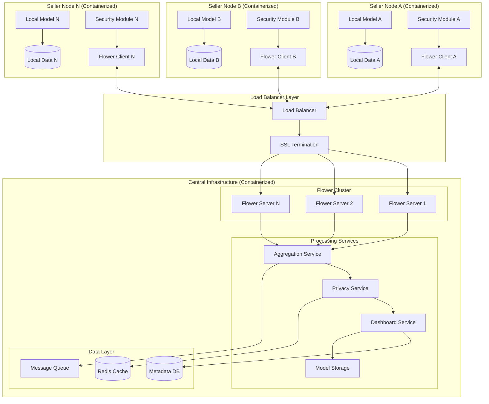
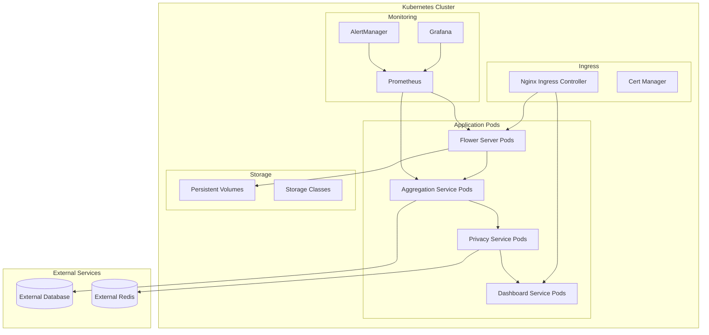
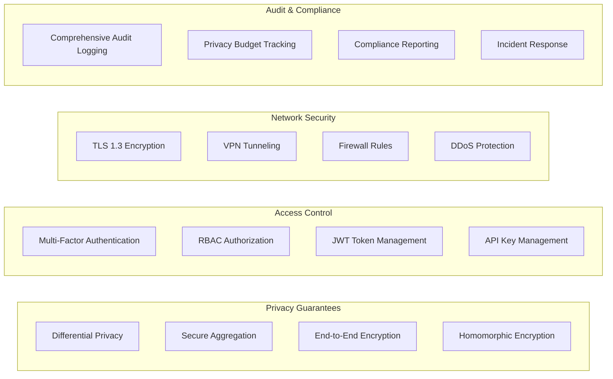

# Design Document: Privacy-Preserving Retail Intelligence Platform

## Overview

The Privacy-Preserving Retail Intelligence Platform is a **horizontal federated learning system** that enables collaborative machine learning across multiple retailers without compromising data privacy. In horizontal federated learning, each retailer has datasets with the same feature space (sales, pricing, inventory data) but different samples (their own customers and transactions), making it ideal for collaborative retail intelligence.

The platform leverages the Flower framework for federated orchestration, implements differential privacy for mathematical privacy guarantees, and uses secure aggregation protocols to protect individual retailer contributions.

The system architecture follows a hub-and-spoke model where each retailer operates a local client that trains models on their private data, while a central server coordinates the federated learning process and delivers aggregated insights through a web dashboard.

## Tech Stack & Dependencies

### Core Frameworks & Libraries

**Federated Learning Orchestration**:
- **Flower (flwr)**: Primary federated learning framework for client-server coordination
- **PyTorch**: Deep learning framework for model implementation
- **NumPy/Pandas**: Data manipulation and numerical computing

**Privacy-Preserving Technologies**:
- **Opacus**: Differential privacy library for PyTorch models
- **Diffprivlib**: IBM's differential privacy library for additional DP mechanisms
- **PySyft**: Secure multi-party computation and homomorphic encryption
- **Crypten**: Facebook's cryptographic framework for secure aggregation

**Backend Services**:
- **Flask/FastAPI**: REST API backend services
- **Celery**: Distributed task queue for asynchronous processing
- **SQLAlchemy**: Database ORM for metadata management
- **Pydantic**: Data validation and serialization

**Frontend & Dashboard**:
- **React.js**: Modern web frontend framework
- **D3.js/Chart.js**: Data visualization libraries
- **Material-UI**: Component library for consistent UI design
- **WebSocket**: Real-time communication for training progress

**Infrastructure & Deployment**:
- **Docker**: Containerization platform
- **Kubernetes**: Container orchestration (Minikube for dev, GKE for production)
- **Helm**: Kubernetes package manager for deployment templates
- **Nginx**: Load balancer and reverse proxy

**Data Layer**:
- **PostgreSQL**: Primary metadata and configuration database
- **Redis**: Caching layer and session storage
- **RabbitMQ**: Message queue for asynchronous communication
- **MinIO**: S3-compatible object storage for model artifacts

**Monitoring & Observability**:
- **Prometheus**: Metrics collection and monitoring
- **Grafana**: Metrics visualization and alerting
- **Jaeger**: Distributed tracing for debugging
- **ELK Stack**: Centralized logging (Elasticsearch, Logstash, Kibana)

### Development Dependencies

**Testing & Quality**:
- **pytest**: Python testing framework
- **Hypothesis**: Property-based testing library
- **black**: Code formatting
- **flake8**: Code linting
- **mypy**: Static type checking

**Security & Compliance**:
- **bandit**: Security vulnerability scanning
- **safety**: Dependency vulnerability checking
- **cryptography**: Low-level cryptographic primitives
- **PyJWT**: JSON Web Token implementation

## Sample End-to-End Flow

### Federated Training and Insight Generation Sequence



### Detailed Step-by-Step Process

1. **Initialization**: Flower server broadcasts training round parameters to all registered retailer clients
2. **Local Training**: Each retailer trains models on their private sales, pricing, and inventory data
3. **Privacy Application**: Differential privacy noise is added to gradients using Opacus (ε-DP guarantees)
4. **Encryption**: Model updates are encrypted using secure aggregation protocols from PySyft
5. **Secure Transmission**: Encrypted updates are sent to the central aggregation service via TLS
6. **Cryptographic Aggregation**: Secure multi-party computation combines updates without decryption
7. **Privacy Validation**: Additional privacy checks ensure compliance with differential privacy budgets
8. **Global Model Creation**: Aggregated model becomes the new global model for distribution
9. **Insight Generation**: Intelligence services generate pricing, forecasting, and bundling recommendations
10. **Dashboard Delivery**: Insights are delivered through the React-based dashboard with role-based access
11. **Business Application**: Retailers apply recommendations and monitor performance for next training cycle

## Architecture

### High-Level Architecture



### Component Architecture

The platform consists of several key architectural layers designed for **horizontal federated learning** scalability and fault tolerance:

**Horizontal Federated Learning Characteristics**:
- **Same Feature Space**: All retailers share common data schema (product_id, price, quantity, timestamp, customer_segment)
- **Different Sample Space**: Each retailer has their own unique customer base and transaction history
- **Model Architecture**: Shared global model architecture trained on distributed but similar datasets
- **Aggregation Strategy**: FedAvg (Federated Averaging) as primary aggregation method with FedProx fallback

**Architectural Layers**:
1. **Load Balancing Layer**: SSL termination and traffic distribution across Flower server instances
2. **Federated Orchestration Layer**: Clustered Flower framework managing horizontal FL client-server communication
3. **Privacy Preservation Layer**: Differential privacy and secure aggregation protocols with caching
4. **Model Training Layer**: Containerized local model training on retailer-specific datasets
5. **Intelligence Layer**: Scalable pricing, forecasting, and bundling analytics services
6. **Presentation Layer**: Load-balanced web dashboard with session management
7. **Data Layer**: Distributed metadata storage with caching and message queuing

### Deployment Architecture



### Communication Protocols

**Federated Learning Protocol**:
- **Transport**: gRPC over TLS 1.3 for Flower client-server communication
- **Serialization**: Protocol Buffers for model parameter exchange
- **Compression**: gzip compression for large model updates
- **Retry Logic**: Exponential backoff with jitter for network failures

**Secure Aggregation Protocol**:
- **Cryptographic Scheme**: Threshold secret sharing with Shamir's scheme
- **Key Exchange**: Elliptic Curve Diffie-Hellman (ECDH) for session keys
- **Integrity**: HMAC-SHA256 for message authentication
- **Forward Secrecy**: Ephemeral keys rotated per training round

**API Communication**:
- **REST APIs**: JSON over HTTPS for dashboard and management operations
- **WebSocket**: Real-time updates for training progress and system status
- **Authentication**: JWT tokens with refresh mechanism
- **Rate Limiting**: Token bucket algorithm per client

### Security Architecture



### Scalability and Performance

**Horizontal Scaling**:
- **Flower Servers**: Auto-scaling based on client connection count
- **Processing Services**: CPU and memory-based horizontal pod autoscaling
- **Database**: Read replicas and connection pooling
- **Cache Layer**: Redis cluster with consistent hashing

**Performance Optimizations**:
- **Model Compression**: Gradient compression and quantization
- **Batch Processing**: Asynchronous aggregation with configurable batch sizes
- **Caching Strategy**: Multi-level caching (L1: in-memory, L2: Redis, L3: database)
- **Connection Pooling**: Persistent connections with keep-alive mechanisms

**Resource Management**:
- **CPU Limits**: Guaranteed CPU allocation per service
- **Memory Limits**: Memory limits with overflow protection
- **Storage**: SSD-backed persistent volumes with automatic backup
- **Network**: Bandwidth throttling and QoS policies

## Components and Interfaces

### Flower Server Component

**Purpose**: Central coordinator for federated learning orchestration using the Flower framework.

**Key Responsibilities**:
- Client registration and authentication
- Training round coordination
- Model aggregation orchestration
- Client selection and sampling

**Interfaces**:
```python
class FlowerServerInterface:
    def register_client(self, client_id: str, credentials: ClientCredentials) -> RegistrationResult
    def start_training_round(self, round_config: RoundConfiguration) -> TrainingRound
    def aggregate_updates(self, client_updates: List[ModelUpdate]) -> GlobalModel
    def evaluate_global_model(self, evaluation_config: EvaluationConfig) -> ModelMetrics
```

### Flower Client Component

**Purpose**: Local horizontal federated learning client running at each retailer location.

**Key Responsibilities**:
- Local model training on retailer's standardized dataset (same features, different samples)
- Model update generation using FedAvg-compatible parameter averaging
- Data schema validation to ensure horizontal FL compatibility
- Communication with central server using Flower's horizontal FL protocols

**Interfaces**:
```python
class HorizontalFLClientInterface:
    def fit(self, parameters: ModelParameters, config: FitConfig) -> FitResult:
        """Train local model on retailer's dataset with standardized schema"""
        pass
    
    def evaluate(self, parameters: ModelParameters, config: EvaluateConfig) -> EvaluateResult:
        """Evaluate global model on local test set"""
        pass
    
    def get_parameters(self) -> ModelParameters:
        """Return current local model parameters for FedAvg aggregation"""
        pass
    
    def validate_data_schema(self, dataset: pd.DataFrame) -> ValidationResult:
        """Ensure local data matches horizontal FL schema requirements"""
        pass
    
    def apply_differential_privacy(self, gradients: Gradients) -> PrivateGradients:
        """Apply DP noise to gradients before sharing in horizontal FL"""
        pass
```

### Secure Aggregation Service

**Purpose**: Cryptographically secure aggregation of model updates without revealing individual contributions.

**Key Responsibilities**:
- Secure multi-party computation protocols
- Dropout resilience during aggregation
- Cryptographic key management
- Aggregation verification and validation

**Interfaces**:
```python
class SecureAggregationInterface:
    def setup_aggregation_round(self, participants: List[ClientID]) -> AggregationRound
    def collect_masked_updates(self, client_updates: List[MaskedUpdate]) -> CollectionResult
    def unmask_and_aggregate(self, collection_result: CollectionResult) -> AggregatedModel
    def verify_aggregation_integrity(self, aggregated_model: AggregatedModel) -> VerificationResult
```

### Differential Privacy Service

**Purpose**: Implementation of differential privacy mechanisms to provide mathematical privacy guarantees.

**Key Responsibilities**:
- Privacy budget management and tracking
- Noise calibration and injection
- Privacy parameter configuration
- Privacy accounting and reporting

**Interfaces**:
```python
class DifferentialPrivacyInterface:
    def add_noise_to_gradients(self, gradients: Gradients, epsilon: float, delta: float) -> NoisyGradients
    def track_privacy_budget(self, client_id: str, epsilon_spent: float) -> PrivacyBudgetStatus
    def calibrate_noise_parameters(self, sensitivity: float, privacy_params: PrivacyParams) -> NoiseParams
    def generate_privacy_report(self, client_id: str) -> PrivacyReport
```

### Intelligence Analytics Service

**Purpose**: Generate business intelligence insights from federated models while preserving privacy.

**Key Responsibilities**:
- Pricing optimization recommendations
- Demand forecasting analytics
- Product bundling suggestions
- Market trend analysis

**Interfaces**:
```python
class IntelligenceAnalyticsInterface:
    def generate_pricing_insights(self, model: GlobalModel, market_context: MarketContext) -> PricingInsights
    def forecast_demand(self, model: GlobalModel, forecast_horizon: TimePeriod) -> DemandForecast
    def recommend_bundles(self, model: GlobalModel, product_catalog: ProductCatalog) -> BundleRecommendations
    def analyze_market_trends(self, model: GlobalModel, trend_config: TrendConfig) -> MarketAnalysis
```

### Dashboard Service

**Purpose**: Web-based interface for accessing insights and managing federated learning operations.

**Key Responsibilities**:
- User authentication and authorization
- Insight visualization and reporting
- System monitoring and status
- Configuration management

**Interfaces**:
```python
class DashboardInterface:
    def authenticate_user(self, credentials: UserCredentials) -> AuthenticationResult
    def get_pricing_dashboard(self, user_context: UserContext) -> PricingDashboard
    def get_forecasting_dashboard(self, user_context: UserContext) -> ForecastingDashboard
    def get_bundling_dashboard(self, user_context: UserContext) -> BundlingDashboard
    def get_system_status(self, user_context: UserContext) -> SystemStatus
```

## Data Models

### Horizontal Federated Learning Data Schema

```python
@dataclass
class RetailDataSchema:
    """Standardized schema for horizontal federated learning across retailers"""
    # Common feature space across all retailers
    product_id: str
    category: str
    price: float
    quantity_sold: int
    timestamp: datetime
    customer_segment: str
    promotion_active: bool
    seasonal_factor: float
    competitor_price: Optional[float]
    inventory_level: int
    
    # Retailer-specific identifier (kept local, never shared)
    retailer_id: str  # Only used locally, not in federated training
    customer_id: str  # Hashed/anonymized, never shared in raw form

@dataclass
class HorizontalFLConfig:
    """Configuration for horizontal federated learning"""
    feature_columns: List[str]  # Standardized features across retailers
    target_column: str  # Common prediction target
    min_samples_per_retailer: int  # Minimum dataset size for participation
    max_retailers_per_round: int  # Maximum participants per training round
    aggregation_strategy: str  # "fedavg", "fedprox", "scaffold"
    data_validation_schema: Dict[str, Any]  # Schema validation rules
```

### Core Federated Learning Models

```python
@dataclass
class ModelParameters:
    """Represents neural network parameters for federated learning"""
    layers: Dict[str, np.ndarray]
    metadata: ModelMetadata
    version: int
    checksum: str

@dataclass
class ModelUpdate:
    """Encrypted model update from local training"""
    client_id: str
    parameters_delta: EncryptedParameters
    training_metrics: TrainingMetrics
    privacy_spent: float
    timestamp: datetime

@dataclass
class GlobalModel:
    """Aggregated global model from federated learning"""
    parameters: ModelParameters
    round_number: int
    participating_clients: List[str]
    aggregation_method: str
    performance_metrics: ModelMetrics
```

### Privacy and Security Models

```python
@dataclass
class PrivacyBudget:
    """Tracks differential privacy budget consumption"""
    client_id: str
    total_epsilon: float
    spent_epsilon: float
    remaining_epsilon: float
    delta: float
    last_updated: datetime

@dataclass
class SecureAggregationRound:
    """Represents a secure aggregation round"""
    round_id: str
    participants: List[str]
    threshold: int
    public_keys: Dict[str, PublicKey]
    masked_updates: Dict[str, MaskedUpdate]
    status: AggregationStatus
```

### Business Intelligence Models

```python
@dataclass
class PricingInsight:
    """Pricing optimization recommendation"""
    product_id: str
    current_price: float
    recommended_price: float
    confidence_interval: Tuple[float, float]
    expected_revenue_impact: float
    market_position: MarketPosition
    elasticity_estimate: float

@dataclass
class DemandForecast:
    """Demand forecasting prediction"""
    product_id: str
    forecast_horizon: TimePeriod
    predicted_demand: List[float]
    confidence_bounds: List[Tuple[float, float]]
    seasonality_factors: Dict[str, float]
    trend_components: TrendAnalysis

@dataclass
class BundleRecommendation:
    """Product bundling suggestion"""
    bundle_id: str
    products: List[str]
    bundle_price: float
    individual_prices: List[float]
    expected_lift: float
    confidence_score: float
    target_segments: List[CustomerSegment]
```

## Correctness Properties

*A property is a characteristic or behavior that should hold true across all valid executions of a system—essentially, a formal statement about what the system should do. Properties serve as the bridge between human-readable specifications and machine-verifiable correctness guarantees.*

Before writing the correctness properties, let me analyze the acceptance criteria to determine which ones are testable as properties.

Based on the prework analysis, I'll now convert the testable acceptance criteria into correctness properties:

### Property 1: Privacy Preservation Across All Operations
*For any* federated learning operation (training, aggregation, insight generation), the system should ensure that no raw retailer data is exposed or can be inferred from outputs, maintaining mathematical privacy guarantees through differential privacy and secure aggregation.
**Validates: Requirements 3.1, 4.1, 4.5, 6.4, 7.2, 10.1**

### Property 2: Secure Authentication and Authorization
*For any* client connection or insight access attempt, the system should properly authenticate users and enforce role-based access controls before granting access to federated learning operations or business intelligence.
**Validates: Requirements 1.2, 5.2, 6.5**

### Property 3: Federated Training Coordination
*For any* set of registered retailers, the federated learning system should coordinate synchronous model updates, handle participant dropouts gracefully, and distribute updated global models to all active participants.
**Validates: Requirements 1.3, 1.4, 3.3, 3.4**

### Property 4: Local Data Exclusivity
*For any* retailer participant, their local model should train exclusively on their own dataset and generate encrypted updates without accessing external retailer data.
**Validates: Requirements 2.1, 2.2**

### Property 5: Privacy Budget Enforcement
*For any* retailer participant, when their differential privacy budget is consumed, the system should prevent further data contributions while accurately tracking budget consumption across all operations.
**Validates: Requirements 4.2, 4.4**

### Property 6: Multi-Task Model Support
*For any* valid input, the local models should support pricing optimization, demand forecasting, and bundling recommendation tasks with appropriate data validation and minimum dataset requirements.
**Validates: Requirements 2.3, 2.4, 2.5**

### Property 7: Cryptographic Aggregation Integrity
*For any* set of model updates, the secure aggregation should use cryptographic protocols to combine updates without revealing individual contributions while maintaining audit logs.
**Validates: Requirements 3.2, 3.5**

### Property 8: Configurable Privacy Parameters
*For any* privacy configuration, the differential privacy system should accept and properly apply epsilon and delta values while ensuring all outputs meet the specified privacy guarantees.
**Validates: Requirements 4.3, 4.5**

### Property 9: Comprehensive Business Intelligence
*For any* federated model output, the dashboard should display pricing recommendations, demand forecasts, and bundling suggestions with confidence intervals and revenue impact estimates.
**Validates: Requirements 6.1, 6.2, 6.3, 7.5, 9.3**

### Property 10: Adaptive Intelligence Systems
*For any* change in market conditions, seasonal patterns, or external factors, the pricing optimizer, demand forecaster, and bundle recommender should update their recommendations accordingly.
**Validates: Requirements 7.1, 8.2, 8.5, 9.5**

### Property 11: Multi-Horizon Forecasting Capability
*For any* forecasting request, the demand forecaster should provide predictions at multiple time horizons (daily, weekly, monthly) using federated learning insights from multiple retailers.
**Validates: Requirements 8.1, 8.3**

### Property 12: Collaborative Filtering for New Products
*For any* new product, the bundle recommender should use collaborative filtering techniques and federated association learning to identify complementary products and generate recommendations.
**Validates: Requirements 8.4, 9.1**

### Property 13: Multi-Objective Bundle Optimization
*For any* bundle generation request, the bundle recommender should optimize for both revenue and customer satisfaction while supporting seasonal and promotional contexts.
**Validates: Requirements 9.2, 9.4**

### Property 14: Comprehensive Audit and Monitoring
*For any* federated learning operation, the system should provide monitoring, logging, and audit trails without exposing sensitive data, supporting incident response and regulatory compliance.
**Validates: Requirements 5.4, 10.3, 10.5**

### Property 15: Regulatory Compliance and Data Lifecycle
*For any* data processing operation, the system should comply with GDPR, CCPA, and industry regulations while implementing proper data retention policies and secure deletion procedures.
**Validates: Requirements 10.2, 10.4**

## Error Handling

### Fault Tolerance and Resilience

**Service-Level Fault Tolerance**:
- **Circuit Breaker Pattern**: Automatic service isolation during failures
- **Bulkhead Pattern**: Resource isolation to prevent cascade failures
- **Timeout Management**: Configurable timeouts with graceful degradation
- **Health Checks**: Kubernetes liveness and readiness probes

**Data Consistency and Recovery**:
- **Distributed Transactions**: Two-phase commit for critical operations
- **Event Sourcing**: Immutable event log for system state reconstruction
- **Backup Strategy**: Automated daily backups with point-in-time recovery
- **Disaster Recovery**: Multi-region deployment with automated failover

**Network Partition Handling**:
- **Split-Brain Prevention**: Consensus algorithms for leader election
- **Partition Tolerance**: CAP theorem considerations with eventual consistency
- **Network Healing**: Automatic reconnection and state synchronization
- **Offline Mode**: Local operation capability during network outages

### System Constraints and Limitations

**Performance Constraints**:
- **Maximum Participants**: 1000 concurrent seller nodes per cluster
- **Model Size Limits**: 500MB maximum model size for efficient transfer
- **Training Round Duration**: 30-minute maximum per federated training round
- **Aggregation Latency**: Sub-5-second aggregation for up to 100 participants

**Privacy Constraints**:
- **Privacy Budget**: ε ≤ 10.0 lifetime budget per seller with δ = 10^-5
- **Minimum Participants**: 5 minimum participants for secure aggregation
- **Data Retention**: 90-day maximum retention for aggregated insights
- **Anonymization**: k-anonymity with k ≥ 5 for all published statistics

**Resource Constraints**:
- **Memory Requirements**: 8GB minimum RAM per Flower server instance
- **Storage Requirements**: 1TB minimum for model storage and metadata
- **Network Bandwidth**: 100Mbps minimum for stable federated training
- **CPU Requirements**: 4 cores minimum per processing service instance

**Regulatory Constraints**:
- **Data Residency**: Seller data must remain within specified geographic boundaries
- **Audit Requirements**: 7-year retention for all audit logs and compliance records
- **Encryption Standards**: FIPS 140-2 Level 3 compliance for cryptographic operations
- **Access Logging**: Complete audit trail for all data access and model operations

### Privacy Budget Exhaustion
When a seller's differential privacy budget is exhausted, the system gracefully excludes them from future training rounds while maintaining their access to previously generated insights. The system provides clear notifications about budget status and estimated refresh times based on configured privacy policies.

### Client Dropout Handling
The secure aggregation protocol implements threshold-based aggregation that can tolerate up to 30% client dropouts per training round. When dropouts exceed the threshold, the system postpones aggregation until sufficient participants are available or switches to a degraded mode with reduced privacy guarantees.

### Data Quality Issues
Local models implement comprehensive data validation including:
- **Missing Value Detection**: Statistical imputation with privacy-preserving techniques
- **Outlier Identification**: Robust statistical methods with differential privacy
- **Schema Validation**: Strict schema enforcement against expected data formats
- **Minimum Dataset Requirements**: Configurable thresholds per model type and use case

### Network Connectivity Issues
The Flower framework implements sophisticated retry mechanisms:
- **Exponential Backoff**: Configurable backoff parameters with jitter
- **Connection Pooling**: Persistent connections with automatic reconnection
- **State Synchronization**: Automatic state recovery after network partitions
- **Graceful Degradation**: Reduced functionality during partial connectivity

### Model Convergence Failures
The system monitors model convergence with multiple strategies:
- **Convergence Metrics**: Loss function monitoring with early stopping
- **Alternative Aggregation**: FedProx, FedNova fallback strategies
- **Adaptive Learning Rates**: Dynamic adjustment based on convergence patterns
- **Model Validation**: Cross-validation across participant subsets

## Testing Strategy

### Dual Testing Approach

The platform requires both unit testing and property-based testing for comprehensive coverage:

**Unit Tests**: Focus on specific examples, edge cases, and error conditions including:
- Authentication and authorization edge cases
- Privacy budget boundary conditions
- Network failure scenarios
- Data validation error cases
- Cryptographic protocol edge cases

**Property-Based Tests**: Verify universal properties across all inputs including:
- Privacy preservation across random datasets
- Secure aggregation with varying participant sets
- Model convergence across different data distributions
- Dashboard functionality with random model outputs
- Regulatory compliance across various data processing scenarios

### Property-Based Testing Configuration

The testing strategy uses **Hypothesis** (Python) for property-based testing with the following configuration:
- Minimum 100 iterations per property test
- Each property test references its design document property
- Tag format: **Feature: retail-intelligence-platform, Property {number}: {property_text}**

### Testing Framework Integration

**Federated Learning Testing**:
- Use Flower's simulation mode for testing federated scenarios
- Mock multiple retailer clients with synthetic datasets
- Test privacy preservation using differential privacy auditing tools

**Cryptographic Testing**:
- Verify secure aggregation protocols using cryptographic test vectors
- Test key management and rotation procedures
- Validate encryption/decryption round-trip properties

**Privacy Testing**:
- Implement differential privacy composition testing
- Verify privacy budget tracking accuracy
- Test noise calibration across different sensitivity levels

**Integration Testing**:
- End-to-end federated learning workflows
- Dashboard integration with federated models
- Multi-retailer collaboration scenarios
- Regulatory compliance validation

## Licensing & Ethics

### Open Source Licensing

**Core Platform License**: Apache 2.0 License for maximum commercial compatibility and adoption
- Permits commercial use, modification, and distribution
- Requires preservation of copyright and license notices
- Provides patent protection for contributors and users

**Third-Party Dependencies**: Compatible open-source licenses
- Flower Framework: Apache 2.0
- PyTorch: BSD 3-Clause
- React.js: MIT License
- PostgreSQL: PostgreSQL License (BSD-style)

### Model Interpretability and Transparency

**Explainable AI Features**:
- **SHAP Integration**: Shapley Additive Explanations for model decision transparency
- **Feature Importance**: Privacy-preserving feature importance scores for pricing decisions
- **Confidence Intervals**: All recommendations include uncertainty quantification
- **Audit Trails**: Complete lineage tracking for model decisions and data usage

**Model Documentation**:
- **Model Cards**: Standardized documentation for each federated model including performance metrics, limitations, and intended use cases
- **Fairness Metrics**: Regular evaluation of model fairness across different retailer segments
- **Performance Monitoring**: Continuous monitoring of model drift and performance degradation

### Anti-Bias and Fairness Measures

**Algorithmic Fairness**:
- **Demographic Parity**: Ensure recommendations don't systematically disadvantage specific retailer categories
- **Equalized Opportunity**: Equal accuracy across different retailer segments and geographic regions
- **Individual Fairness**: Similar retailers receive similar recommendations under similar conditions

**Bias Detection and Mitigation**:
- **Pre-processing**: Data preprocessing techniques to identify and mitigate historical biases
- **In-processing**: Fairness constraints during federated model training
- **Post-processing**: Calibration techniques to ensure fair outcomes across retailer segments

**Diversity and Inclusion**:
- **Inclusive Design**: Platform designed to accommodate retailers of all sizes and technical capabilities
- **Accessibility**: Dashboard complies with WCAG 2.1 AA accessibility standards
- **Multi-language Support**: Internationalization support for global retailer participation

### Ethical Guidelines and Governance

**Data Ethics Principles**:
- **Purpose Limitation**: Data used only for stated business intelligence purposes
- **Data Minimization**: Collect and process only necessary data for federated learning
- **Consent Management**: Clear opt-in/opt-out mechanisms for all participants
- **Right to Explanation**: Users can request explanations for all algorithmic decisions

**Governance Framework**:
- **Ethics Review Board**: Regular review of platform usage and impact on retail ecosystem
- **Stakeholder Engagement**: Ongoing consultation with retailers, privacy advocates, and regulators
- **Impact Assessment**: Regular evaluation of platform's effect on market competition and consumer welfare
- **Responsible Disclosure**: Clear procedures for reporting and addressing ethical concerns

**Competitive Fairness**:
- **Market Competition**: Platform designed to enhance rather than restrict healthy market competition
- **Anti-Collusion Measures**: Technical and policy safeguards against price-fixing or market manipulation
- **Small Retailer Protection**: Special provisions to ensure small retailers benefit from collaborative intelligence
- **Transparency Requirements**: Clear disclosure of platform capabilities and limitations to all participants

### Privacy by Design

**Privacy-First Architecture**:
- **Data Minimization**: Technical enforcement of minimal data collection and processing
- **Purpose Binding**: Cryptographic enforcement of data usage limitations
- **Proactive Privacy**: Privacy protections built into system architecture rather than added later
- **End-to-End Privacy**: Privacy guarantees maintained throughout the entire data lifecycle

**User Rights and Control**:
- **Data Portability**: Users can export their model contributions and insights
- **Right to Deletion**: Complete removal of user data and model contributions upon request
- **Granular Consent**: Fine-grained control over data usage and sharing preferences
- **Privacy Dashboard**: Real-time visibility into privacy budget usage and data processing activities